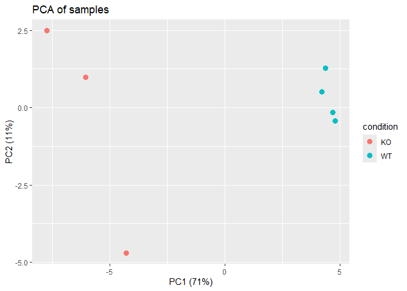
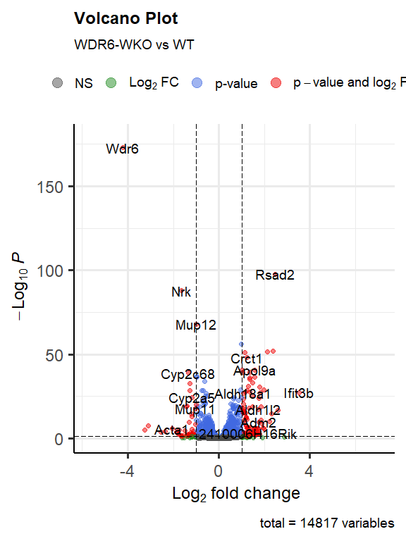
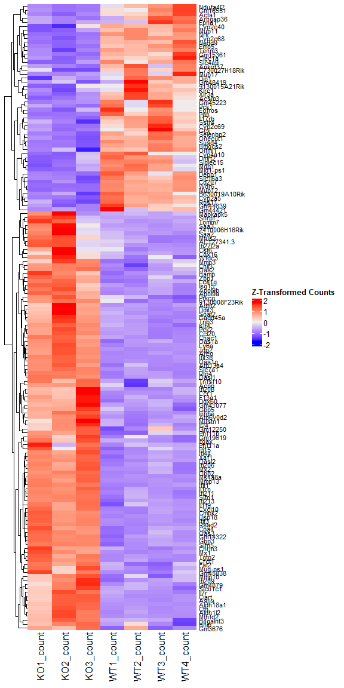
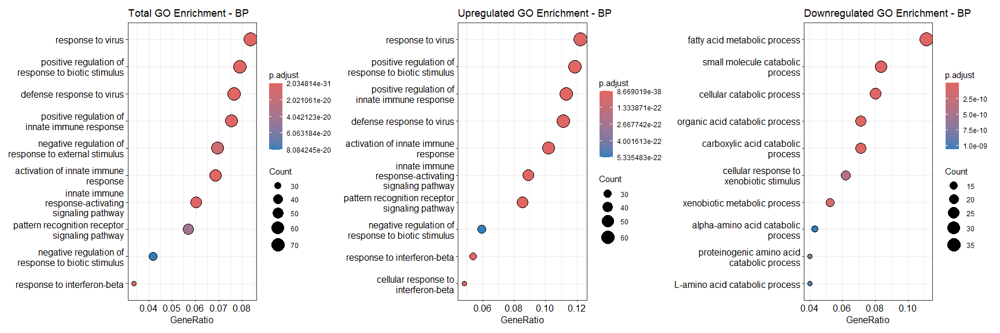
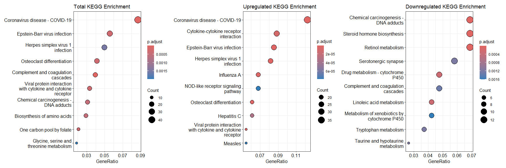

RNAseq Analysis of GSE205459
================

Bulk RNAseq Analysis based on the GEO database dataset
[GSE205459](https://www.ncbi.nlm.nih.gov/geo/query/acc.cgi?acc=GSE205459)

organism: mus musculus (mouse) comparison: whole body knockout of Wdr6
to WT

Step by step code

# Libraries

Loading in necessary packages for analysis:

``` r
library(DESeq2)
library(dplyr)
library(ggplot2)
library(EnhancedVolcano)
library(ComplexHeatmap)
library(AnnotationHub)
library(clusterProfiler)
library(org.Mm.eg.db)
```

Creating dds Object:

``` r
cts <- read.table(file.path(work_dir, "GSE205459_WT_and_KO_readcounts.txt"), header = T)
cts <- aggregate(cts[ , -1], list(gene_id = cts[, 1]), FUN = sum)
rownames(cts) <- cts$gene_id
cts$gene_id <- NULL

coldata <- read.csv(file.path(work_dir, "SraRunTable.csv"))
rownames(coldata) <- coldata$Name
coldata$Name <- NULL

cts <- cts[, rownames(coldata)]

dds <- DESeqDataSetFromMatrix(
  countData = cts,
  colData = coldata,
  design    = ~ condition
)

dds <- DESeq(dds)
```

# Exploratory data analysis

A crucial step of the bulk rna-seq analysis pipeline is ensuring the
data displays a clear relationship that can be studied. This is done
through visualizing the data on a pca plot, which shows a clear
separation of the experimental design along PCA 1.

``` r
vsd <- vst(dds, blind = FALSE)
pcaData <- plotPCA(vsd, intgroup = "condition", returnData = TRUE)
percentVar <- round(100 * attr(pcaData, "percentVar"))
pca <- ggplot(pcaData, aes(PC1, PC2, color = condition)) +
  geom_point(size = 3) +
  xlab(paste0("PC1 (", percentVar[1], "%)")) +
  ylab(paste0("PC2 (", percentVar[2], "%)")) +
  ggtitle("PCA of samples")
```

<!-- -->

# Differential Expression Analysis

The inbuilt results function will return log2foldchange values and
p-val/p-adj needed for downstream differential expression analysis.

``` r
res <- results(dds, contrast = c("condition", "KO", "WT"))
```

Volcano Plot of DGEs with the log2foldchange cutoff of 1 and p-adj
cutoff of 0.05.

``` r
v1 <- EnhancedVolcano(res,
                      lab = rownames(res),
                      x = "log2FoldChange",
                      y = "padj",
                      pCutoff = 0.05,
                      FCcutoff = 1.0,
                      title = "Volcano Plot",
                      subtitle = "WDR6-WKO vs WT")
```

<!-- -->

Heatmap of DGEs with the same cut off:

``` r
res_clean <- res[!is.na(res$log2FoldChange) & !is.na(res$padj), ]
sig_genes_list <- rownames(res_clean[abs(res_clean$log2FoldChange) > 1 & 
                                       res_clean$padj < 0.05, ])

mat <- counts(dds, normalized=T)
mat <- mat[sig_genes_list, , drop=F]

mat.z <- t(scale(t(as.matrix(mat))))
Heatmap(mat.z,
        cluster_rows = T,
        cluster_columns = F,
        name = "Z-Transformed Counts",
        row_labels = rownames(mat.z),
        row_names_gp = gpar(fontsize = 8))
```

<!-- -->

# Pathway Enrichment

significant genes were defined as those with a log2foldchange \> 0.35
and a p-adj \< 0.05 to match the paper. entrez ids were assigned using
the mapIds function.

``` r
sig_genes <- res_clean[abs(res_clean$log2FoldChange) > 0.35 & 
                         res_clean$padj < 0.05, ]

sig_genes$entrez_id <- mapIds(org.Mm.eg.db,
                              keys = rownames(sig_genes),
                              column = "ENTREZID",
                              keytype = "SYMBOL",
                              multiVals = "first")
```

This is an example function of running GO Enrichment on all 3 gene lists
(Total, up, down) and ont (BP, MF, CC) based on gene_list (complete list
of significant DEGs).

``` r
run_go <- function(gene_list) {
  
  onts <- c("BP", "CC", "MF")
  
  for (ont in onts) {
    #Total
    ego <- enrichGO(gene = gene_list$entrez_id,
                    OrgDb = org.Mm.eg.db,
                    keyType = "ENTREZID",
                    ont = ont,
                    pAdjustMethod = "BH",
                    pvalueCutoff = 0.05,
                    qvalueCutoff = 0.2,
                    readable = TRUE)
    
    if (!is.null(ego) && nrow(ego@result) > 0) {
      
      d1 <- dotplot(ego, showCategory=10) + ggtitle(paste("Total GO Enrichment -", ont))
    }
    
    genes_up <- gene_list$entrez_id[gene_list$log2FoldChange > 0]
    genes_down <- gene_list$entrez_id[gene_list$log2FoldChange < 0]
    
    #Up 
    up <- enrichGO(gene = genes_up,
                   OrgDb = org.Mm.eg.db,
                   keyType = "ENTREZID",
                   ont = ont,
                   pAdjustMethod = "BH",
                   pvalueCutoff = 0.05,
                   qvalueCutoff = 0.2,
                   readable = TRUE)
    
    if (!is.null(up) && nrow(up@result) > 0) {
      d2 <- dotplot(up, showCategory=10) + ggtitle(paste("Upregulated GO Enrichment -", ont))
    }
    
    #Down
    down <- enrichGO(gene = genes_down,
                     OrgDb = org.Mm.eg.db,
                     keyType = "ENTREZID",
                     ont = ont,
                     pAdjustMethod = "BH",
                     pvalueCutoff = 0.05,
                     qvalueCutoff = 0.2,
                     readable = TRUE)
    
    if (!is.null(down) && nrow(down@result) > 0) {
      d3 <- dotplot(down, showCategory=10) + ggtitle(paste("Downregulated GO Enrichment -", ont))
    }
  }
}


run_kegg <- function(gene_list) {
  
  ont_dir <- file.path(pe_dir, "KEGG")
  
  if (!dir.exists(ont_dir)) {
    dir.create(ont_dir, recursive = TRUE)
  }
  
  #Total
  kegg <- enrichKEGG(gene = gene_list$entrez_id,
                     organism = 'mmu',            
                     keyType = "kegg",           
                     pAdjustMethod= "BH",
                     pvalueCutoff = 0.05,
                     qvalueCutoff = 0.2)
  
  if (!is.null(kegg) && nrow(kegg@result) > 0) {
    d3 <- dotplot(kegg, showCategory = 10) + ggtitle("Total KEGG Enrichment")
    ggsave(filename = file.path(ont_dir, "Total_KEGG_Enrichment_Dotplot.png"),
           plot = d3, width = 8, height = 6, dpi = 600)
    write.csv(as.data.frame(kegg),
              file = file.path(ont_dir, "Total_KEGG_Enrichment.csv"))
  }
  
  genes_up <- gene_list$entrez_id[gene_list$log2FoldChange > 0]
  genes_down <- gene_list$entrez_id[gene_list$log2FoldChange < 0]
  
  #Up
  kegg_up <- enrichKEGG(gene = genes_up,
                        organism = 'mmu',
                        keyType = "kegg",
                        pAdjustMethod = "BH",
                        pvalueCutoff = 0.05,
                        qvalueCutoff = 0.2)
  if (!is.null(kegg_up) && nrow(kegg_up@result) > 0) {
    d3 <- dotplot(kegg_up, showCategory = 10) + 
      ggtitle("Upregulated KEGG Enrichment")
    ggsave(filename = file.path(ont_dir, "Upregulated_KEGG_Enrichment_Dotplot.png"),
           plot = d3, width = 8, height = 6, dpi = 600)
    write.csv(as.data.frame(kegg_up),
              file = file.path(ont_dir, "Upregulated_KEGG_Enrichment.csv"))
  }
  
  
  #Down
  kegg_down <- enrichKEGG(gene = genes_down,
                          organism = 'mmu',
                          keyType = "kegg",
                          pAdjustMethod = "BH",
                          pvalueCutoff = 0.05,
                          qvalueCutoff = 0.2)
  if (!is.null(kegg_down) && nrow(kegg_down@result) > 0) {
    d3 <- dotplot(kegg_down, showCategory = 10) + 
      ggtitle("Downregulated KEGG Enrichment")
    ggsave(filename = file.path(ont_dir, "Downregulated_KEGG_Enrichment_Dotplot.png"),
           plot = d3, width = 8, height = 6, dpi = 600)
    write.csv(as.data.frame(kegg_down),
              file = file.path(ont_dir, "Downregulated_KEGG_Enrichment.csv"))
  }
  
}
```

Example output:

<!-- -->

    ##                    ID                                         Description
    ## GO:0051607 GO:0051607                           defense response to virus
    ## GO:0009615 GO:0009615                                   response to virus
    ## GO:0002833 GO:0002833  positive regulation of response to biotic stimulus
    ## GO:0002218 GO:0002218                activation of innate immune response
    ## GO:0045089 GO:0045089       positive regulation of innate immune response
    ## GO:0002758 GO:0002758 innate immune response-activating signaling pathway
    ##            GeneRatio   BgRatio RichFactor FoldEnrichment   zScore       pvalue
    ## GO:0051607    66/862 330/28832  0.2000000       6.689559 18.24884 3.889171e-35
    ## GO:0009615    72/862 414/28832  0.1739130       5.817008 17.33078 4.424457e-34
    ## GO:0002833    68/862 441/28832  0.1541950       5.157483 15.44531 5.847960e-29
    ## GO:0002218    59/862 331/28832  0.1782477       5.961994 15.93960 1.108433e-28
    ## GO:0045089    65/862 410/28832  0.1585366       5.302699 15.40433 1.965237e-28
    ## GO:0002758    52/862 301/28832  0.1727575       5.778357 14.62987 9.556088e-25
    ##                p.adjust       qvalue
    ## GO:0051607 2.034814e-31 1.323956e-31
    ## GO:0009615 1.157438e-30 7.530891e-31
    ## GO:0002833 1.019884e-25 6.635896e-26
    ## GO:0002218 1.449830e-25 9.433345e-26
    ## GO:0045089 2.056424e-25 1.338016e-25
    ## GO:0002758 8.332908e-22 5.421822e-22
    ##                                                                                                                                                                                                                                                                                                                                                                                                                                                                      geneID
    ## GO:0051607                                             Abcc9/Adar/Bnip3/Bst2/Card9/Cd207/Cxcl10/Ddit4/Ddx60/Dhx58/Eif2ak2/Fgl2/Gbp2/Gbp4/Gbp5/Gbp7/Gm12250/Gpam/Ifi203/Ifi206/Ifi207/Ifi208/Ifi209/Ifi213/Ifih1/Ifit1/Ifit2/Ifit3/Ifit3b/Ifitm3/Igtp/Irf7/Irgm1/Irgm2/Isg15/Itgax/Mmp12/Mndal/Mx2/Ndufaf4/Oas1a/Oas1b/Oas1c/Oas1g/Oas2/Oas3/Oasl1/Oasl2/Parp9/Polr3d/Pycard/Rnf135/Rsad2/Rtp4/Slfn8/Stat1/Stat2/Tlr3/Treml4/Trim12a/Trim21/Trim30a/Trim30d/Trim7/Usp18/Zbp1
    ## GO:0009615 2410002F23Rik/Abcc9/Adar/Bnip3/Bst2/Card9/Cd207/Cxcl10/Ddit4/Ddx60/Dhx58/Eif2ak2/Fgl2/Gbp2/Gbp4/Gbp5/Gbp7/Gm12250/Gpam/Ifi203/Ifi206/Ifi207/Ifi208/Ifi209/Ifi213/Ifi27l2a/Ifih1/Ifit1/Ifit2/Ifit3/Ifit3b/Ifitm3/Igtp/Irf7/Irgm1/Irgm2/Isg15/Itgax/Itgb6/Lcn2/Mmp12/Mndal/Mx1/Mx2/Ndufaf4/Oas1a/Oas1b/Oas1c/Oas1g/Oas2/Oas3/Oasl1/Oasl2/Parp9/Polr3d/Pycard/Rnf135/Rsad2/Rtp4/Slfn8/Stat1/Stat2/Tgtp1/Tlr3/Treml4/Trim12a/Trim21/Trim30a/Trim30d/Trim7/Usp18/Zbp1
    ## GO:0002833                         Adam8/Arf6/Arg1/Banf1/Bmp6/Card9/Cd274/Cd300lf/Clec4n/Clec7a/Cyba/Ddx60/Dhx58/Eif2ak2/Ereg/Fosl1/Gbp2/Gbp3/Gbp5/Gbp7/Gm12250/Gpatch3/Hrg/Ifi203/Ifi204/Ifi206/Ifi207/Ifi208/Ifi209/Ifi211/Ifi213/Ifi35/Ifih1/Igtp/Irf7/Irgm1/Irgm2/Klrc1/Lbp/Mmp12/Mndal/Oas1a/Oas1b/Oas1c/Oas1g/Oas3/Oasl1/Parp9/Polr3d/Pycard/Rnf135/Rsad2/Slc15a2/Slc15a3/Slc19a1/Smpdl3b/Sqstm1/Syk/Tifab/Tlr3/Tlr5/Trem2/Treml4/Trim12a/Trim30a/Trim30d/Tyrobp/Zbp1
    ## GO:0002218                                                                           Arf6/Banf1/Cd274/Cd300lf/Clec4n/Clec7a/Cyba/Ddx60/Dhx58/Eif2ak2/Fosl1/Gbp2/Gbp3/Gbp5/Gbp7/Gm12250/Gpatch3/Ifi203/Ifi204/Ifi206/Ifi207/Ifi208/Ifi209/Ifi211/Ifi213/Ifi35/Ifih1/Igtp/Irf7/Irgm1/Irgm2/Klrc1/Lbp/Mndal/Oas1a/Oas1b/Oas1c/Oas1g/Oas3/Oasl1/Pycard/Rnf135/Rsad2/Slc15a2/Slc15a3/Slc19a1/Smpdl3b/Sqstm1/Syk/Tifab/Tlr3/Tlr5/Trem2/Treml4/Trim12a/Trim30a/Trim30d/Tyrobp/Zbp1
    ## GO:0045089                                       Adam8/Arf6/Banf1/Card9/Cd274/Cd300lf/Clec4n/Clec7a/Cyba/Ddx60/Dhx58/Eif2ak2/Ereg/Fosl1/Gbp2/Gbp3/Gbp5/Gbp7/Gm12250/Gpatch3/Ifi203/Ifi204/Ifi206/Ifi207/Ifi208/Ifi209/Ifi211/Ifi213/Ifi35/Ifih1/Igtp/Irf7/Irgm1/Irgm2/Klrc1/Lbp/Mmp12/Mndal/Oas1a/Oas1b/Oas1c/Oas1g/Oas3/Oasl1/Parp9/Polr3d/Pycard/Rnf135/Rsad2/Slc15a2/Slc15a3/Slc19a1/Smpdl3b/Sqstm1/Syk/Tifab/Tlr3/Tlr5/Trem2/Treml4/Trim12a/Trim30a/Trim30d/Tyrobp/Zbp1
    ## GO:0002758                                                                                                                        Arf6/Banf1/Cd274/Cd300lf/Clec4n/Clec7a/Cyba/Ddx60/Dhx58/Eif2ak2/Fosl1/Gbp2/Gbp5/Gm12250/Gpatch3/Ifi203/Ifi206/Ifi207/Ifi208/Ifi209/Ifi213/Ifi35/Ifih1/Igtp/Irf7/Irgm1/Irgm2/Klrc1/Lbp/Mndal/Oas1a/Oas1b/Oas1c/Oas1g/Oas3/Oasl1/Pycard/Rnf135/Rsad2/Slc15a2/Slc15a3/Slc19a1/Smpdl3b/Sqstm1/Syk/Tifab/Tlr3/Tlr5/Trem2/Treml4/Trim30a/Tyrobp
    ##            Count
    ## GO:0051607    66
    ## GO:0009615    72
    ## GO:0002833    68
    ## GO:0002218    59
    ## GO:0045089    65
    ## GO:0002758    52

Important BP results included in the paper include fatty acid metabolic
processes.

KEGG is similar, but there’s option for different ontologies:

``` r
run_kegg <- function(gene_list) {
  #Total
  kegg <- enrichKEGG(gene = gene_list$entrez_id,
                     organism = 'mmu',            
                     keyType = "kegg",           
                     pAdjustMethod= "BH",
                     pvalueCutoff = 0.05,
                     qvalueCutoff = 0.2)
  
  if (!is.null(kegg) && nrow(kegg@result) > 0) {
    d1 <- dotplot(kegg, showCategory = 10) + ggtitle("Total KEGG Enrichment")
  }
  
  genes_up <- gene_list$entrez_id[gene_list$log2FoldChange > 0]
  genes_down <- gene_list$entrez_id[gene_list$log2FoldChange < 0]
  
  #Up
  kegg_up <- enrichKEGG(gene = genes_up,
                        organism = 'mmu',
                        keyType = "kegg",
                        pAdjustMethod = "BH",
                        pvalueCutoff = 0.05,
                        qvalueCutoff = 0.2)
  if (!is.null(kegg_up) && nrow(kegg_up@result) > 0) {
    d2 <- dotplot(kegg_up, showCategory = 10) + ggtitle("Upregulated KEGG Enrichment")
  }
  
  
  #Down
  kegg_down <- enrichKEGG(gene = genes_down,
                          organism = 'mmu',
                          keyType = "kegg",
                          pAdjustMethod = "BH",
                          pvalueCutoff = 0.05,
                          qvalueCutoff = 0.2)
  if (!is.null(kegg_down) && nrow(kegg_down@result) > 0) {
    d3 <- dotplot(kegg_down, showCategory = 10) + ggtitle("Downregulated KEGG Enrichment")
  }
  
}
```

<!-- -->

    ##                                      category
    ## mmu05171                       Human Diseases
    ## mmu04610                   Organismal Systems
    ## mmu04380                   Organismal Systems
    ## mmu00670                           Metabolism
    ## mmu04061 Environmental Information Processing
    ## mmu05169                       Human Diseases
    ##                                   subcategory       ID
    ## mmu05171            Infectious disease: viral mmu05171
    ## mmu04610                        Immune system mmu04610
    ## mmu04380         Development and regeneration mmu04380
    ## mmu00670 Metabolism of cofactors and vitamins mmu00670
    ## mmu04061  Signaling molecules and interaction mmu04061
    ## mmu05169            Infectious disease: viral mmu05169
    ##                                                            Description
    ## mmu05171                                Coronavirus disease - COVID-19
    ## mmu04610                           Complement and coagulation cascades
    ## mmu04380                                    Osteoclast differentiation
    ## mmu00670                                     One carbon pool by folate
    ## mmu04061 Viral protein interaction with cytokine and cytokine receptor
    ## mmu05169                                  Epstein-Barr virus infection
    ##          GeneRatio   BgRatio RichFactor FoldEnrichment   zScore       pvalue
    ## mmu05171    42/483 334/10569  0.1257485       2.751627 7.118385 1.932673e-09
    ## mmu04610    19/483  94/10569  0.2021277       4.422955 7.294551 3.612167e-08
    ## mmu04380    20/483 136/10569  0.1470588       3.217939 5.696722 3.402255e-06
    ## mmu00670    10/483  37/10569  0.2702703       5.914051 6.552327 4.135998e-06
    ## mmu04061    16/483  95/10569  0.1684211       3.685387 5.753379 5.514539e-06
    ## mmu05169    27/483 229/10569  0.1179039       2.579972 5.289534 5.627310e-06
    ##              p.adjust       qvalue
    ## mmu05171 6.203881e-07 4.882543e-07
    ## mmu04610 5.797528e-06 4.562737e-06
    ## mmu04380 3.010611e-04 2.369394e-04
    ## mmu00670 3.010611e-04 2.369394e-04
    ## mmu04061 3.010611e-04 2.369394e-04
    ## mmu05169 3.010611e-04 2.369394e-04
    ##                                                                                                                                                                                                                                                                              geneID
    ## mmu05171 56417/12262/230558/12279/20296/15945/13649/19106/74145/14131/14161/110135/99571/15200/71586/16391/100038882/26415/17175/17392/17857/17858/246730/23961/23960/246728/246727/18752/268449/19942/57808/54217/67281/67945/78294/100043813/54127/20846/20847/20963/142980/22186
    ## mmu04610                                                                                                                                                       12262/230558/12279/14058/109821/74145/14066/14161/110135/99571/16409/16411/16644/17175/18792/18793/18788/20720/18816
    ## mmu04380                                                                                                                                                    17060/12977/13038/13057/14129/14131/14282/14283/16391/26399/26415/18733/19016/19261/18412/20846/20847/20963/83433/22177
    ## mmu00670                                                                                                                                                                                                      216188/434437/107869/14317/104174/270685/17768/17769/100039707/108037
    ## mmu04061                                                                                                                                                                            20296/20297/56221/20303/20305/20306/20308/12768/12774/12977/15945/57266/20311/93672/56744/22035
    ## mmu05169                                                                                                  17060/12443/15945/19106/13197/17873/23882/15015/110557/15018/15205/54123/16391/100038882/26399/26415/246730/23961/23960/246728/246727/60406/20422/20846/20847/20963/21354
    ##          Count
    ## mmu05171    42
    ## mmu04610    19
    ## mmu04380    20
    ## mmu00670    10
    ## mmu04061    16
    ## mmu05169    27
